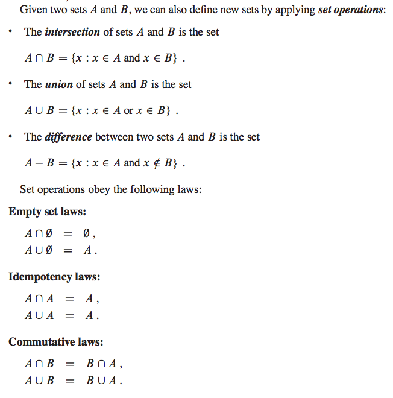

# 集合 set

集合是一种不包含重复元素的数据结构，经常用来判断是否重复这种操作，或者集合中是否存在一个元素。
这一章讲集合，实际上它的底层也是哈希表实现的，所以像实现 DictADT 一样，借助 HashTable 实现它也比较简单。


# 集合操作
集合可能最常用的就是去重，判断是否存在一个元素等，但是 set 相比 dict 有更丰富的操作，主要是数学概念上的。
如果你学过《离散数学》中集合相关的概念，基本上是一致的。 python 的 set 提供了如下基本的集合操作，
假设有两个集合 A，B，有以下操作：

- 交集: A & B，表示同时在 A 和 B 中的元素。 python 中重载  `__and__` 实现
- 并集: A | B，表示在 A 或者 B 中的元素，两个集合相加。python 中重载 `__or__` 实现
- 差集:  A - B，表示在 A 中但是不在 B 中的元素。 python 中重载 `__sub__` 实现
- 对称差: A ^ B，返回在 A 或 B 但是不在 A、B 中都出现的元素。其实就是 (A|B) - (A&B)， python 中重载 `__xor__` 实现

这里使用的  &, |, -, ^ 在 python 内置的 set 实现中都是重载了内置的运算符。这里我们也用这种方式实现，
具体实现我会在视频里演示。python 同样实现了  intersection, union, difference, symmetric_difference 这四个方法，
和使用运算符的功能是一样的。



# python frozenset
在 python 里还有一个 frozenset，看它的名字就知道这种也是集合，但是它的内容是无法变动的。一般我们使用
它的常见就是用一个可迭代对象初始化它，然后只用来判重等操作。


# 实现一个 set ADT
如何实现一个集合的 ADT 呢，其实还是个哈希表，哈希表不是有 key 和 value 嘛，咱把 value 置为 1 不就行了。

```py
class SetADT(HashTable):

    def add(self, key):
        # 集合其实就是一个 dict，只不过我们把它的 value 设置成 1
        return super(SetADT, self).add(key, True)
```

当然其它数学上的操作就麻烦点了，不过也很容易实现。


# 思考题
- 集合判断一个元素是否存在的时间复杂度是多少？
- 集合的元素 key 需要满足什么概念？可变对象可以吗？
- 请你在 SetADT 基础上实现集合的 remove 操作和 pop 操作
- 你能尝试实现对称差操作吗？这里我没有实现，留给你作为练习
- 你知道如何重载 python 的内置运算符吗？这里我们实现 set 的集合操作就是用到了重载，请阅读相关 python 文档。
- 当元素个数不多的时候，我们可以用 set 来判重，但是如果是大量元素会非常耗费内存。请你了解下 Bloom Filter


# 延伸阅读
阅读 python 文档关于 set 的相关章节，了解 set 还有哪些操作？比如比较运算符的概念，比较两个集合意味着什么。
